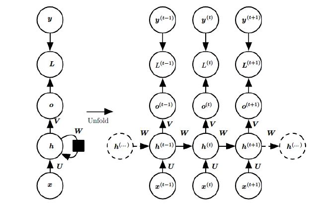

# 编码器解码器结构
编码器解码器（Encoder-Decoder）结构，是深度学习的一个抽象概念。描述了深度学习中对任务过程的抽象概括：
**输入内容经过编码器得到特征，特征经过解码器得到结果。**  
他未必是显式的分为2个模块。
例如在MLP中，可以认为前n-1层是编码器，输出层是解码器。
CV中，前面的卷积池化层是编码器，后面的mlp是解码器。
即使在RNN中，亦可认为隐层h是编码器，输出层是解码器。  
而Seq2Seq是显式的编码器解码器结构：
<!-- more -->
  

# Seq2Seq的中间特征
从图片可以看到，Seq2Seq天然适配NLP中序列对序列的任务（翻译，对话等）  
上图是展开形式，实际上Seq2Seq就是两个RNN模型相连。  
其连接就是前一个RNN输出的中间状态$h$

## 隐向量的组合方法

<!--    -->
  

对于一个简单RNN模型，$h$就是可以把信息带到下一个词的隐向量  
所以在连接2个RNN的Seq2Seq中，自然也是把前一个RNN的最后一个词的隐向量$h_{last}^{en}$作为后一个RNN的初始隐向量$h_0^{de}$

### 简单组合
Decoder如何利用Encoder的$h$有多种方式。  
1. 直接作为Decoder初始的隐向量是一种：
<!--   -->
  

2. Decoder也可以在处理每个词的时候都引入$h_{last}^{en}$，以确保Encoder信息对当前词的影响。  
<!--  -->
  

当使用第二种方式之后，再追求更好效果，应该从什么角度改进？  
1. $h_{last}^{en}$ 虽然也包含了前面词的信息，但实际上是衰减的。
2. decoder输出词应该与encoder输入词相对应，即decoder应该看到$h_{last}^{en}$之前的隐向量。尤其在机器翻译任务中。

基于以上两点，注意力机制被提出

### 注意力机制-Attention
当需要decoder关注到encoder的所有隐向量时，具体如何做？
- 首先不能一一对应，因为输入和输出不一定等长，
- 那就把隐向量用某种方式组合起来$f(h^{en})$

组合有多种选择：拼接，相加，平均，加权平均等
为了让decoder每个输出都关注到不同的信息，$f(h^{en})$应该是变化的。
decoder在处理每一个输出时，都应该能注意到他应该注意到的信息。
所以$f(h^{en})$应该是加权平均的组合方式：  

$$f(h^{en})_j= \sum \alpha_{ji} \cdot h_{i}^{en}$$

那$\alpha_i$怎么计算？
$\alpha_i$ 应该与当前decoder状态$h_j^{de}$和所有encoder状态$h_i^{en}$有关：
$$\alpha_{ji} = h_j^{de} \cdot h_i^{en}$$  

如图所示，$w$即$\alpha$ , 这样每个decoder输出，都能注意到不同的信息(因为权重不同，组合偏重不同)

**需注意**，这里的注意力计算过程，没有产生新的**需要训练**的参数，只是利用已有的参数做了计算。

注意力机制直接启发了Transformer。在自然语言中，一句话，一段文表达不同意思，本质也是因为词与词之间的相互作用，如果理解了每个词与其他词的关系，也就理解了这个词。做个比喻：在人类社会中，你周围人眼中的你组成了你。如果不能直接建模你，那就找与你有关系的人($\alpha$)，看他们的评价。

所以注意力机制，抓住了nlp的一个核心。

# Encoder Decoder模型变化
RNN有一个问题：随着序列加长，前面词的信息会衰减的很严重，梯度的计算也会消失或爆炸
针对这一问题，有LSTM，GRU两大改进模型

## LSTM - Long Short-Term Memory

普通RNN有一个隐藏状态$h$，LSTM有2个：细胞状态$C$，隐藏状态$h$   
LSTM设计了3个门：  

$$
\begin{alignedat}{2}
遗忘门: f_t &= \sigma(W_f \cdot [h_{t-1}, x_t] + b_f) \\
输入门: i_t &= \sigma(W_i \cdot [h_{t-1}, x_t] + b_i) \\
输出门: o_t &= \sigma(W_o \cdot [h_{t-1}, x_t] + b_o) \\
\end{alignedat}$$


### 细胞状态C的改变
设计一个细胞状态变量$\tilde{C_t} $, 它与$C_{t-1}$组合成为$C_{t}$  

$$
\begin{alignedat}{2}
\tilde{C_t} &= tanh(W_c \cdot [h_{t-1}, x_t] + b_c) \\
C_t &= f_t \odot C_{t-1} + i_t \odot \tilde{C_t}\\
\end{alignedat}$$


### 隐藏状态h的改变
隐藏状态则是细胞状态与输出门的组合  

$$
\begin{alignedat}{2}
h_t &= o_t \odot tanh(C_t) \\
\end{alignedat}$$


三个门可以认为是阀门，即对某一个量做0~1缩放。  
当$f_t,i_t,o_t$依次为1，0，1时，即不遗忘不输入全输出，则$C_t=C_{t-1}$, $h_t=tanh(C_t)$ 

当$f_t,i_t,o_t$依次为0，1，1时，即全遗忘全输入全输出，则$C_t=\tilde{C_{t-1}}$, $h_t=tanh(C_t)$  

当$f_t,i_t,o_t$依次为1，1，0时，即不遗忘全输入不输出，则$C_t=C_{t-1} + \tilde{C_{t-1}}$, $h_t=0$

以此减小梯度消失/爆炸问题

## GRU -  Gated Recurrent Unit

  
GRU少了细胞状态，只有2个门，减少了计算量，提高了计算效率。

# Seq2Seq优势

 - 一个最主要优势是，Seq2Seq模型便于处理输入输出**不等长的数据**，在翻译中输入和输出长度往往不同。而相比之下，单个RNN在处理这种数据时，性能可能差一点。
 - Seq2Seq为解码器如何利用中间状态提供了很大探索空间，为**注意力机制**的发展提供了结构基础。
 - 翻译任务中，源语言和目的语言在映射到高维空间时，其内在的分布是不同的，将两个空间分别交由两个RNN处理，是一种**解耦**的处理方式，符合直觉。